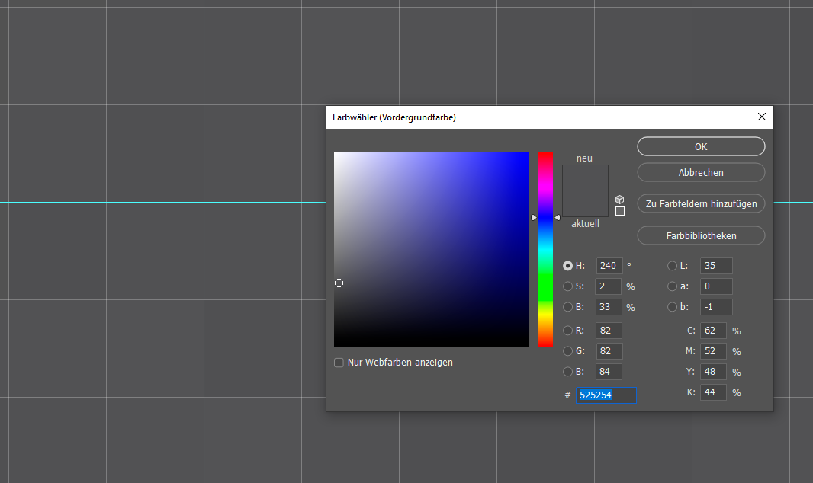

# Lösung - Tag 6 - Die Nachrichten

Klaas eröffnet eine Nachrichtensendung mit folgenden Worten:

```
Guten Abend meine Damen udn Herren zu den RGB Nachrichten.

Am Berliner HBF wurde eine Klaas Heufer-Umlauf Statue enthüllt. Mit der Aktion wollte Witzbolt Joko W seinem Kollegen ein sprichwörtliches Denkmal setzen und für einen signifikaten Eintrag im enzklopädischen Sinne sorgen. Für Joko stelle Klaas, so der Künstler, ein echtes Original, vom großen Format da, ein bildnes gar von einem Manne mit einem riesig roten Herzen.

Selbst Bundeskanzlerin Angela Merkel lies sich nicht nehmen per Pressemitteilung zu gratulieren. Ihre Glückwünsche nutze sie außerdem für eine kryptische Botschaft an die Nation

**2262 und 5025**
Insider vermuten sie sei etwas blau gewesen. Nicht Rot oder Grün, sondern Blau.
```

Die ganze Zeit wird im Hintergrund ein Bild eingeblendet, welches die Statue zeigt.

Es handelt sich um folgendes Bild: https://de.m.wikipedia.org/wiki/Datei:Klaas_heufer-umlauf_statue_berlin_2.jpg

Öffnet man das Programm in einem Bildbearbeitungstool, wie z.B. Photoshop und geht dort an die Stelle 2262 x 5025 und markiert dort die Farbe kommen folgende RGB Werte heraus:

```
R: 82
G: 82
B: 84
```



Es wird explizit erwähnt, dass nur nach Blau gesucht wird.

**Lösung**: 84